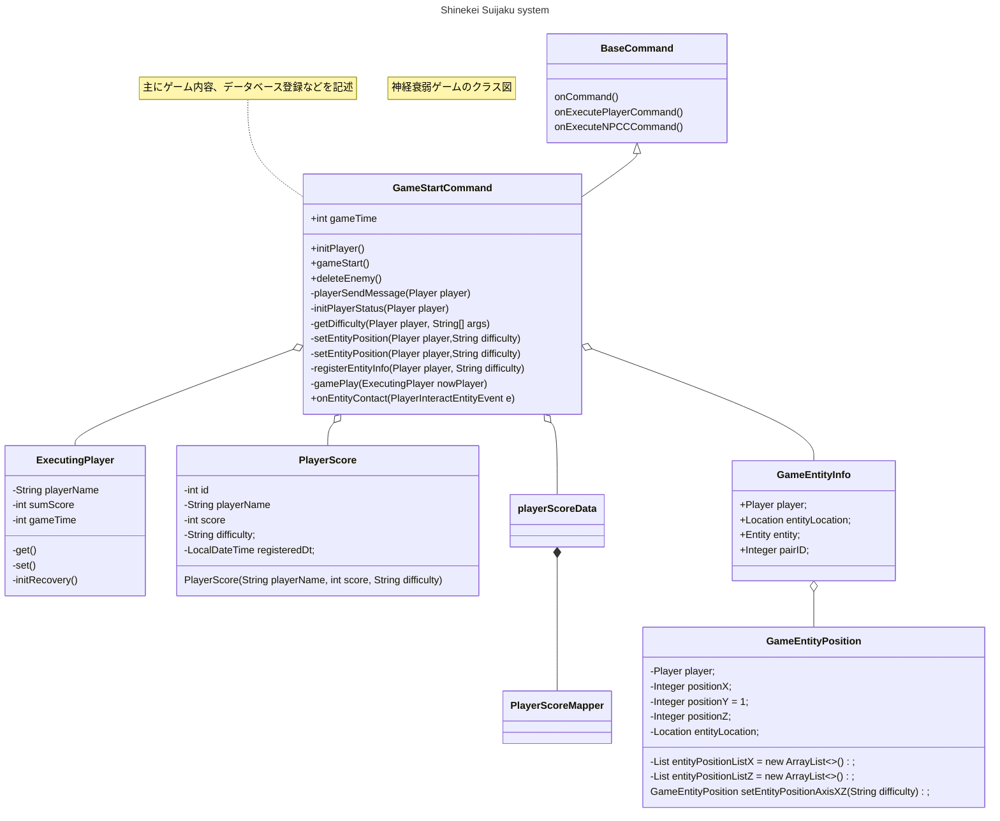
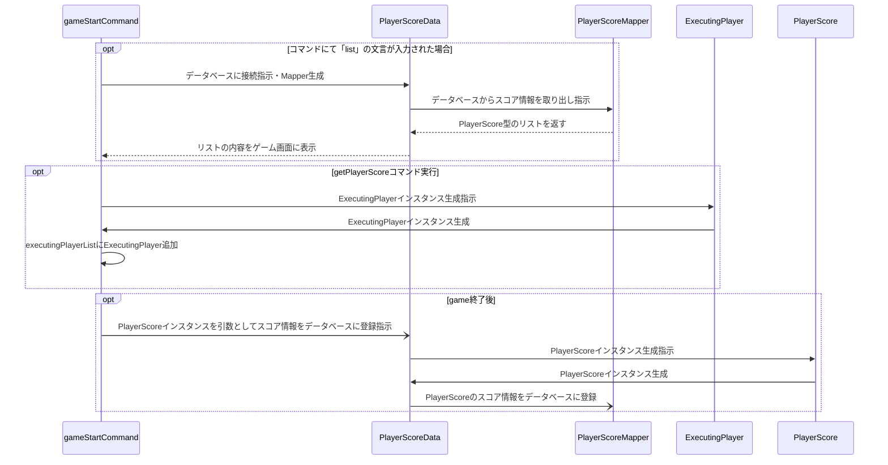

```mermaid
---
title: Shinekei Suijaku system
---
classDiagram
    note "神経衰弱ゲームのクラス図"
    BaseCommand <|-- GameStartCommand
    note for GameStartCommand "主にゲーム内容、データベース登録などを記述"
    GameStartCommand o-- ExecutingPlayer
    GameStartCommand o-- PlayerScore
    GameStartCommand o-- playerScoreData
%%    GameStartCommand o-- GameEntityPosition
    GameStartCommand o-- GameEntityInfo
    GameEntityInfo o-- GameEntityPosition
    playerScoreData *-- PlayerScoreMapper
    
    class BaseCommand {
        onCommand()
        onExecutePlayerCommand()
        onExecuteNPCCCommand()
    }    
    class GameStartCommand {
        +int gameTime
        +initPlayer()
        +gameStart()
        +deleteEnemy()
        -playerSendMessage(Player player)
        -initPlayerStatus(Player player)
        -getDifficulty(Player player, String[] args)
        -setEntityPosition(Player player,String difficulty)
        -setEntityPosition(Player player,String difficulty)
        -registerEntityInfo(Player player, String difficulty)
        -gamePlay(ExecutingPlayer nowPlayer)
        +onEntityContact(PlayerInteractEntityEvent e)
    }
    
    class ExecutingPlayer {
        -String playerName
        -int sumScore
        -int gameTime
        -get()
        -set()
        -initRecovery()
    }

    class PlayerScore {
        -int id
        -String playerName
        -int score
        -String difficulty;
        -LocalDateTime registeredDt;
        PlayerScore(String playerName, int score, String difficulty)
    }
    
    class GameEntityPosition {
        -Player player;
        -Integer positionX;
        -Integer positionY = 1;
        -Integer positionZ;
        -Location entityLocation;
        -List<Integer> entityPositionListX = new ArrayList<>();
        -List<Integer> entityPositionListZ = new ArrayList<>();
        GameEntityPosition setEntityPositionAxisXZ(String difficulty);
    }
    
    class GameEntityInfo {
        +Player player;
        +Location entityLocation;
        +Entity entity;
        +Integer pairID;
    }
```
    

```mermaid
sequenceDiagram
    opt コマンドにて「list」の文言が入力された場合
        gameStartCommand->>PlayerScoreData:データベースに接続指示・Mapper生成
        PlayerScoreData->>PlayerScoreMapper:データベースからスコア情報を取り出し指示
        PlayerScoreMapper-->>PlayerScoreData:PlayerScore型のリストを返す
        PlayerScoreData-->>gameStartCommand:リストの内容をゲーム画面に表示
    end
    opt getPlayerScoreコマンド実行
        gameStartCommand->>ExecutingPlayer:ExecutingPlayerインスタンス生成指示
        ExecutingPlayer->>gameStartCommand:ExecutingPlayerインスタンス生成
        gameStartCommand->>gameStartCommand:executingPlayerListにExecutingPlayer追加    
    end
    
    opt game終了後
    gameStartCommand-)PlayerScoreData: PlayerScoreインスタンスを引数としてスコア情報をデータベースに登録指示
    PlayerScoreData->>PlayerScore: PlayerScoreインスタンス生成指示
    PlayerScore->>PlayerScoreData: PlayerScoreインスタンス生成
    PlayerScoreData-)PlayerScoreMapper: PlayerScoreのスコア情報をデータベースに登録
    end
    
```